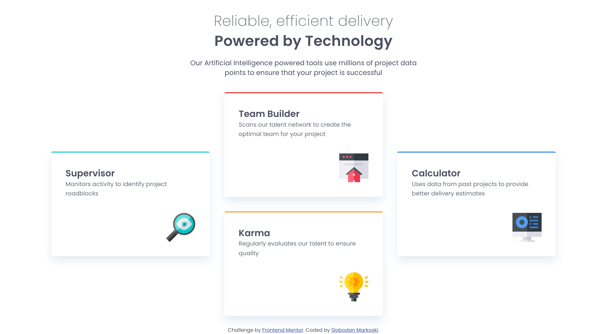
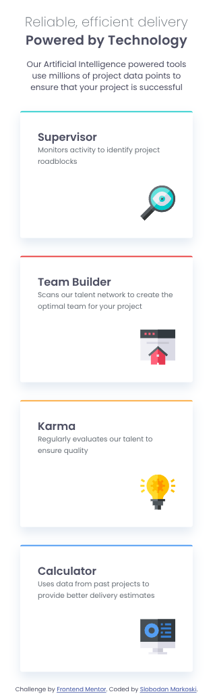
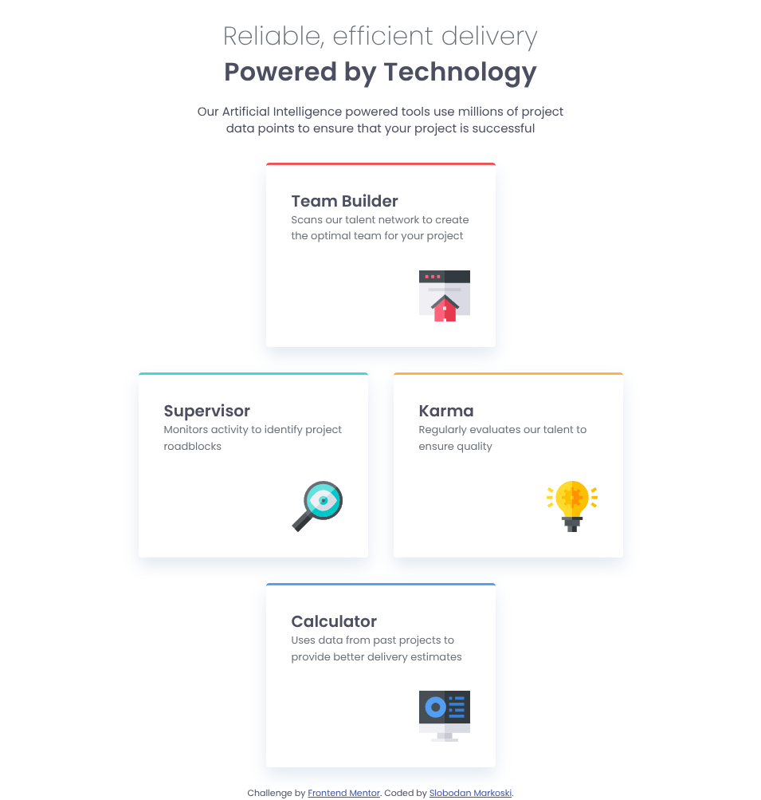

# Frontend Mentor - Four card feature section solution

This is a solution to the [Four card feature section challenge on Frontend Mentor](https://www.frontendmentor.io/challenges/four-card-feature-section-weK1eFYK). Frontend Mentor challenges help you improve your coding skills by building realistic projects.

## Table of contents

- [Overview](#overview)
  - [The challenge](#the-challenge)
  - [Screenshot](#screenshot)
- [My process](#my-process)
  - [Built with](#built-with)
  - [What I learned](#what-i-learned)
- [Author](#author)

## Overview

### The challenge

Users should be able to:

- View the optimal layout for the site depending on their device's screen size

### Screenshot





## My process

### Built with

- Semantic HTML5 markup
- CSS custom properties
- Flexbox
- CSS Grid
- Mobile-first workflow

### What I learned

grid technics for varius sizes

```css
.card-container {
  width: 100%;
  grid-template-columns: repeat(4, minmax(6px, 8rem));
  grid-template-rows: repeat(3, auto);
}

.card:first-child {
  grid-column: 1/3;
  grid-row: 2/3;
}

.card:nth-child(2) {
  grid-column: 2/4;
  grid-row: 1/2;
}
```

## Author

Slobodan Markoski
